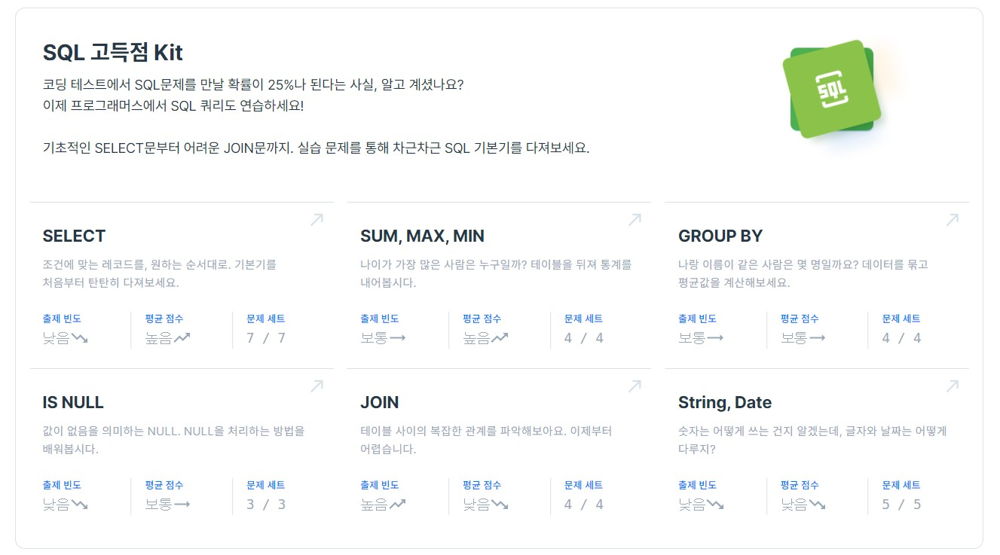

## SQL 실전문제 

인프런 강의 듣고 SQL 실전문제 풀어보기

#### 💻 Reference : 인프런 '백문이 불여일타 - 데이터 분석을 위한 SQL'

#### ⛵ Site : 프로그래머스 https://programmers.co.kr/learn/challenges?tab=sql_practice_kit (SQL 고득점 키트)       

#### 🧵 Explanation: MY Blog!! https://blog.naver.com/ksy_59

|날짜|학습 내용|맞은 개수|틀린문제|비고|
|--------|-------|---------|---------|----------------|
|1226|SELECT|7/7|||
|1226|SUM, MAX, MIN|4/4|||
|1227|GROUP BY|2/4|입양 시각 구하기(1), (2)|datetime에서 시각을 뽑아내려면 HOUR함수 쓰면 된다. 없는 시각을 만들어내려면 @hour = -1 광역변수 설정해주고, (WHERE @hour := @hour +1) < 24 이런식으로 while문 돌리듯이 쿼리를 짜준다|
|1228|IS NULL|3/3||
|1230|JOIN|4/4||
|1231|STRNG, DATE|5/5||

